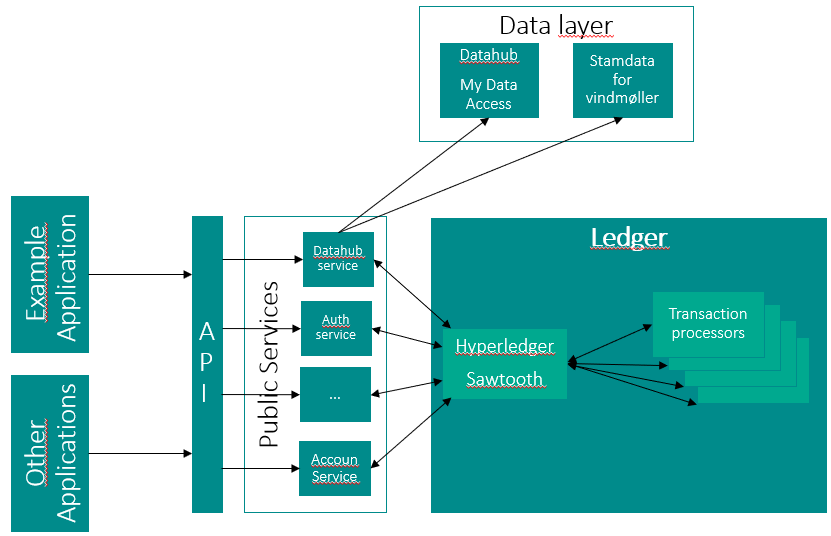

<!-- Background
Base design goals

architectural design
- blockchain
- distributed setup
- wallets
- measurements
- ggo

- account service
- architectural view -->

# Architectural Overview

**TODO List all repositories**

This document outlines the overall architecture of the implemented prototype platform.

(Temp image)

TODO: Afhængighed fra ledger til "Public services" er forkert - pilene bør kun pege fra services til ledger og ikke den anden vej rundt.

# <a id="datahub-service">Shared verifiable storage (blockchain)</a>

At the core of the platform is the blockchain. It is intended to be the single source of truth where end-users, third-parties, etc. can verify GGOs. In this prototype, it is currently implemented using Hyperledger Sawtooth, but a replacement is already under way.

The blockchain is [detailed in this document ](blockchain-protocols.md).

Furthermore, [a Python library](https://github.com/project-origin/ledger-sdk-python) has been developed to enable easy integration with blockchain.

TODO describe Origin-Ledger-SDK.

# <a id="datahub-service">DataHubService</a>

This service is responsible for bridging the danish DataHub with the rest of the platform. DataHub exposes metering points and measurements from the danish consumers via an API, and DataHubService uses this to fetch data for the platform's users. It imports measurements from DataHub and publishes them to the blockchain while at the same time issues GGOs to the blockchain for production meters.

DataHubService also exposes a few API endpoints to fetch metering points, measurements, and GGOs, and to create publicly available disclosed datasets.

To enable importing of data, users must onboard to DataHub via DataHubService. This process submits an authorization which allows DataHubService to import data for a consumer thus make it available to the rest of the platform.

DataHubService is [open-source and can be found on GitHub](https://github.com/project-origin/datahub-service).

TODO LINK TIL SWAGGER DOCS

# <a id="account-service">AccountService</a>

This service was intended as a way to abstract away the complexity of dealing directly with the blockchain, wallet, and keys to a more friendly account-oriented API. It keeps balance of GGOs and their state, while also exposing a number of endpoints to transfer GGOs to other accounts, and retire GGOs to measurements. Effectively AccountService has a copy of the GGOs on the blockchain to be able to index them for querying and other practical use-cases.

The the complexity of dealing with asynchronous transactions on a blockchain is dealth with in AccountService, thus enabling much more pragmatic approaches to integrating with the platform's APIs.

AccountService also exposes endpoints to generate an environment declaration with detailed emission data and source technology based on account's actual consumption and GGOs.

AccountService is [open-source and can be found on GitHub](https://github.com/project-origin/account-service).

TODO LINK TIL SWAGGER DOCS

# <a id="account-service">Example Application</a>

The example application was created to illustrate the use of the APIs exposed by DataHubService and AccountService, while at the same time enabling the participants of the prototype to interact with the system without implementing their own clients.

Its interface allows users to set up GGO transfer agreements with other users, set up retiring of GGOs to their metering points, while also providing a visual overview of the user's current account balance of GGOs. Furthermore the user can easily generate and download an environment declaration in PDF format based on up-to-date/live data.

Transfer agreements are proposed by one user, then later accepted or declined by the counterpart user. They lasts for a specific period of time, and during this period up to a agreed-upon number of GGOs (energy measured in Watt-Hours) are transferred between the users. The receiving user is able to retire the inbound GGOs to their metering points, or transfer them further to other users, thus acting as a middle-man.

The example application is open-source and both [the backend](https://github.com/project-origin/example-backend) and [the frontend](https://github.com/project-origin/example-frontend) can be found on GitHub.

# <a id="account-service">Authorization</a>

OAuth2 is used for authorization, this enables the users to be able to delegate access to their data to third party clients.

TODO

<!-- 

[Measurements](measurements.md)

[GGO](ggo.md)

- blockchain
- distributed setup
- wallets
- measurements
- ggo -->
