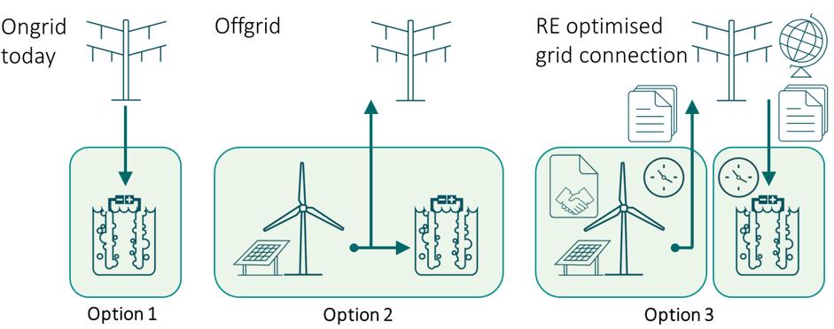
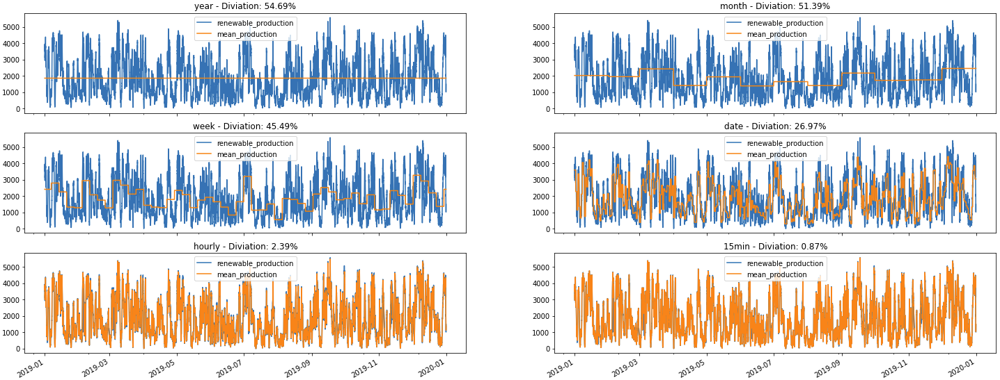

# Project Origin - background

## Definitions
In this document "e-fuels" will refer to "renewable liquid and gaseous transport fuels of non-biological origin"

## RED II directive

Project Origin arose in a brain storming session with Energinets Gas department (Energinet Gas TSO A/S), where we had to find a way to disclose e-fuels, the original issue arose with the RED II directive from the EU.

The EU commission with RED II directive communicates that for e-fuels to be classified as renewable, the issuing bodies must be able to document that the electricity used for the creation of the fuel was renewable.

There is three outlined solutions in the <a href='https://eur-lex.europa.eu/legal-content/EN/TXT/?uri=CELEX:32018L2001'> RED II directive in Article 27</a>:

 
 
1. Grid average - *"For the purposes of this paragraph, where electricity is used for the production of renewable liquid and gaseous transport fuels of non-biological origin, either directly or for the production of intermediate products, the average share of electricity from renewable sources in the country of production, as measured two years before the year in question, shall be used to determine the share of renewable energy."*

2. Directly connected - *"However, electricity obtained from direct connection to an installation generating renewable electricity may be fully counted as renewable electricity where it is used for the production of renewable liquid and gaseous transport fuels of non-biological origin, provided that the installation:*

    *a) comes into operation after, or at the same time as, the installation producing the renewable liquid and gaseous transport fuels of non-biological origin; and*

    *b) is not connected to the grid or is connected to the grid but evidence can be provided that the electricity concerned has been supplied without taking electricity from the grid."*

3. Documentation - *"Electricity that has been taken from the grid may be counted as fully renewable provided that it is produced exclusively from renewable sources and the renewable properties and other appropriate criteria have been demonstrated, ensuring that the renewable properties of that electricity are claimed only once and only in one end-use sector."*

The directive further states: *"Renewable liquid and gaseous transport fuels of non-biological origin are important to increase the share of renewable energy in sectors that are expected to rely on liquid fuels in the long term. To ensure that renewable fuels of non-biological origin contribute to greenhouse gas reduction, the electricity used for the fuel production should be of renewable origin. The Commission should develop, by means of delegated acts, a reliable Union methodology to be applied where such electricity is taken from the grid. That methodology should ensure that there is a **temporal and geographical correlation** between the electricity production unit with which the producer has a bilateral renewables power purchase agreement and the fuel production. For example, renewable fuels of non-biological origin cannot be counted as fully renewable if they are produced when the contracted renewable generation unit is not generating electricity. Another example is the case of electricity grid congestion, where fuels can be counted as fully renewable only when both the electricity generation and the fuel production plants are located on the same side in respect of the congestion. Furthermore, there should be an element of additionality, meaning that the fuel producer is adding to the renewable deployment or to the financing of renewable energy"*

### TL;DR

**The directive outlines that to be able to create e-fuels, one is required to be able to document that renewable electricity is used only once and that there must be a correlation in time between production and use of the electricity, and that there must not be a congestion between the production and consumption sites.**

## Our solution

Project Origin aims for the third solution by providing the necessary documentation.

Our take on RED II directive, is to use the marked resolution, in Denmark this is currently hourly, for time correlation, and to use the price-areas with inter-connectors to model the congestion areas.

During the project we saw it not only benefits the production of e-fuels, but generally to document the use of electricity. Many companies want to have a green profile, and <a href='https://sustainability.google/projects/24x7/'>Google has a goal of using renewable energy matched on an hourly level.</a>

## The GO system

In the EU we currently have a GO (Guarantee of Origin) system, which is defined in law.

The current GO system locks the size of each GO at 1 MWh, so the owner of a facility can be issued a GO for every MWh the facility produces, but the start and end time of each GO can vary, it can be between hours to months.

The electricity supplier who delivers renewable electricity, has to document they own the same number of GOs as the number of MWh renewable electricity they sell. The GO must have been issued within the year they are documenting the electricity for, but no further correlation in time is required.

## Granular Guarantees of Origin

As described above, the current GO system locks the size of each GO to 1 MWh and has a variable time-span. The GGO system created in Project Origin replaces this with the time-span of the market resolution (hourly) and put the discrete amount on the GGO in Wh produced in the time-span.

The reasoning behind this is that electricity has to be used at the same time as it is created, it can not be stored in the grid, as pressure in a pipe. And when you on top of this add that the production of renewable energy fluctuates a lot as the weather changes, we have to look at what can be done.

The best way we found to visualize some of this is with the graphs below. 

The blue line represents the sum of renewable production in a 5 minute resolution for all of Denmark in 2019.

The orange line represents the time-span at which we want to reconcile the GGOs. Currently the GO does it on a yearly basis, which has a mean deviation of 54.69%. 

As we go closer to real time, this deviation becomes smaller, and on an hourly level we are a 2.39% deviation. And when Denmark goes 15 min market resolution the deviation further falls to 0.87% 
 
 

When taking a closer look at the production for two days with hourly mean production on can still se that the system is not perfect, but is far more precise than the currently used yearly resolution. 

 

## Ending comments

Project Origin is not a fully fledged solution, but a learning vehicle to explorer the problem space. It is an experimental platform to build different proposed solutions upon, where it is easy to try different solutions to some of the technical issues, while market actors can try how these technical solutions could work in the real world.

Project Origin has been released in Denmark as an experiment with production data as a system called <a href="https://eloprindelse.dk/">Eloprindelse (Origin of electricity)</a>. Users who want to participate can do so on an opt-in basis, and it is important to note that the entire prototype is one large **"Monopoly game"** in that none of the GGOs issued on it has any value, or proves any actual guarantees.

In is important to note that the GOs and GGOs are both documented claim on electricity. It relates to who can claim to use the electricity produced at some facility. But the actual flow of electrons can be very different from this.

