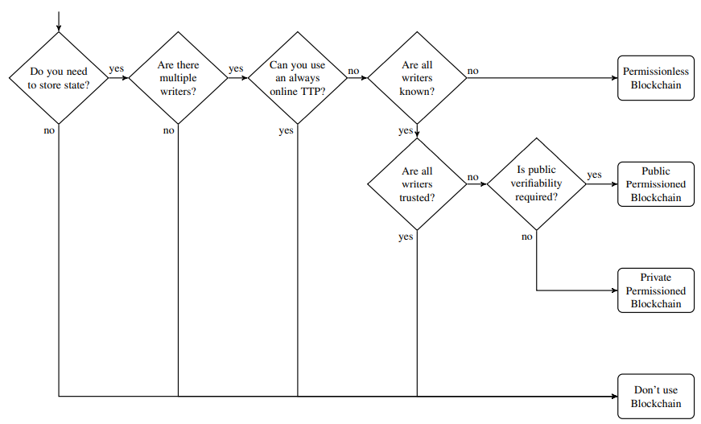

# Should we use blockchain

Based on some of the explanation in the [Verifiable and trustworthy section](Trust.md) we began to look at whether we should use a blockchain or not.

## Flowchart on what to use

One of the papers that stuck was the paper by Karl Wüst and Arthur Gervais. In their paper 
[Do you need a Blockchain?](http://diyhpl.us/~bryan/papers2/bitcoin/Do%20you%20need%20a%20blockchain%3F%20-%202017.pdf) 
they made a flowchart on the decision if one should use a blockchain or not.

 

Our first experience going though this was as follows:

1. Do you need to store state? Yes, we want to store the measurements, GGOs and how they were used.
2. Are there multiple writers? Yes (as of now, no, but we hope to expand the prototype to have multiple participating issuing bodies).
3. Can you use an always online TTP (Trusted Third Party)? No, there currently is no known TTP that offers this sort of solution, and the [trust](trust.md) issues also arose again.
4. Are all writers known? Yes, we cannot alow unknown entities to write data, how would we be able to trust any of the data.
5. Are all writers trusted? No, (original assumption, more one this later) we cannot trust all parties writing to the ledger.
6. Is public verifiability required? Yes, we want everyone to be able to verify their data.

Result: Public Permissioned Blockchain

## Thoughts

There were a series of thoughts that also pointing toward Public Permissioned Blockchain if a blockchain was to be used.

### Regulation

One of the central places where this sort of platform deviates from how things are usually build on a blockchain is regulation.

Laws will be enacted on a national or union level that would have to be enacted on the blockchain whether or not the participating end users agree. This will require that a collection of central parties has the ability to govern and enact laws on the platform, which removes a permissionless blockchain from the list of possibilities.

Using Public Permissioned Blockchain allows the central parties to control the code running on the nodes, and can change the rules to reflect the laws enacted.

### Transactions fees

As we are dealing with micro-transactions, there cannot be a fee on each transaction, since this would otherwise hinder the free movement of GGOs. This directly limits which blockchain technologies can be used, since those based on PoW ([Proof-of-Work](https://en.wikipedia.org/wiki/Proof_of_work)) and transaction fees are no longer relevant options.

Using Public Permissioned Blockchain allows the use of other consensus algorithms that are less resource intensive, thus in turn removes the need for transactions fees.

### Anonymity

TODO

### Scaling

Distributed ledgers are often sited as being resource intensive and having scaling issues due to the sequential processing of transactions. This heavily depends on the consensus algorithm and underlying blockchain technology used.

Permissionless blockchains often use Proof-of-Work or other resource-intensive algorithms to optain consensus between nodes, and this coupled with transaction fees being out of question significantly reduces the options available for choosing a blockchain backend.

When looking at Denmark, we have 3.5 million metering points. Around 130.000 of these are production metering points. Each of these will result in a measurement being published to the ledger every hour, and each production meter in a GGO as well on top of this. This makes 3.6 million transaction every hour, just to issue the measurements and GGOs.

As a minimum each GGO has to be split and retired to a measurement, each resulting in a minimum of further 2 transactions per metering point. This makes 10.8 million transaction every hour (or 3,000 per second).

When scaling this from Denmark to the EU we go from 3.5 million metering points to around 350 million which would roughly equal to 300.000 transactions per second, which is outside the scope of performance of any currently known blockchain technology.

This highlights that we will have an issue handling all transactions on a ledger, and why moving these sort of transactions off-ledger seems like the logical step. 

We are currently looking into how this can be done in the best way, while still making it verifiable.

<!-- 
## The trilemma
- Other way to look at it#
- We must be in control -> Laws change
- public cannot chose how they want it to work.
- Performance PoW vs other 
 -->

# Issues with using a blockchain

Since the ownership of a GGO depends on having access to the private keys for the address on the ledger, there arises the issue if an owner loses their wallet/keys, or if they become compromised.

There is no sure way for the issuing bodies to know who owns a specific GGO, and has no ability to verify it if the owner lost their key, so there is no way for the issuing body to grant the owner access to their GGOs again.

This is the same issue as exists on other blockchains when the owner looses their wallet.

# Learnings of trust and blockchain

If you have read [the part about trust](trust.md), you will notice we highlight that the blockchain itself does not solve the issue on how to trust data from the physical world and move it to the digital world, thus a trust framework is still needed for this. In other words, we have to create trust to the meters and other writers to the ledger, so we know what they are writing is indeed trustworthy.

When we then revisit the flowchart (above) and go through it again with these learnings, we come to a new result.

At point 5: Are all writers trusted? We can now answer yes.

This results in their work telling us we shouldn't use a blockchain.

Using another implementation than a blockchain also helps with the scalability issues mentioned earlier.

# Current chose

Earlier in the process we chose to use a Public Permissioned Blockchain.

The chose was Hyperledger Sawtooth since it provided the needed functionality for the prototype.

Even though we already knew it would not scale to the necessary size needed, not event for Denmark.

It is currently work in progress to move to a off ledger solution while still providing the verifiability.

