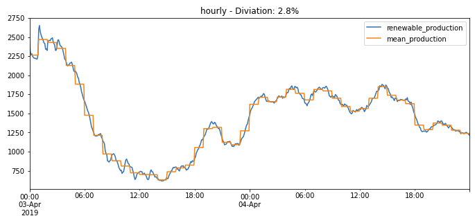

# Core decisions 

There were made a number of early decisions, which formed how the prototype platform turned out.

Each of these decisions will be further explained in the following chapters.

- The platform is a learning vehicle to fail-fast.
- The platform must be open-source.
- The platform should liberalize and enable even access to data.
- The platform should enable innovation.
- The platform must be opt-in.
- The platform will settle each individual electricity meter with GGOs.
- The platform will be based on the measurements peoples bill are settled upon.
- The platform will use the highest granularity of data available.

## Learning vehicle

This prototype is developed for both the participating parties to be able to see how a future platform would look and work, while we at Energinet run into many of the core issues that arise. 

While in this early prototype stage, it is fairly easy to change the way core elements of the platform works or performs with minimal impact for participating parties. This enables us to receive feedback, quickly react and implement changes, and test these changes for all participating parties.

Issues are also far less expensive (time and monetary wise) to explore and test different solutions to while in an early prototype experiment, rather than while developing a production-grade solution.

## Open source

It was essential to create the platform in an open environment so everyone can participate and perform oversight on how things are done. We hope the learnings from the platform can help with more innovation in the sector as the project progresses.

## Liberalize data

A core aspect of the platform is to enable users as much insight into their data as possible. All the user's data must be made available through APIs so they can access their own data in the way they wish. Users must also be able to delegate access to any of their data and APIs so any third parties can act on their behalf.

## Enable innovation

We want to enable innovation by allowing third parties to build new solutions on top of the platform. This is done by providing low-friction integration by exposing easy-to-use high-level APIs.

## Opt-in

Because of the nature of an experimental platform like this, we want people to actively chose to be a part of it as long as it is a prototype project. User's rights to their own data is extremely important, and we want to safeguard their rights any way possible.

We do opt-in by using the third party API on an existing service called [Eloverblik](https://eloverblik.dk/) where users already have access to their measurements. Here users can sign in with their national digital signature and grant this prototype access to their data.

## Individual settled meters

GGOs will be used to settle the exact amount of electricity used on each meter. This will enable the most granular documentation of the origin of the electricity as possible.

## Based on measurements

In Denmark we settle and bill the metering points based on two virtual metering-points consumption (E17) and production (E18).

Without going into deep explanation, the E17 and E18 are the actual amount consumed and produced, no matter how the individual installation is configured at the specific location. The E17 and E18 is what the end customer is billed and settle upon. 

We use these measurements as the basis for everything in this platform. These measurements are available on an hourly resolution for all of Denmark, and are available in Wh. And users can already access their data directly on [Eloverblik](https://eloverblik.dk/).

All GGOs are issued based on production measurements together with a metadata set which denotes what type of production technology it is based on.

All consumption measurements are then settled using the GGOs to document the origin og the electricity. And if no GGOs are used, then the residual mix in the grid will be used to calculate emission data for an environmental declaration.

## Highest granular data

Currently in Denmark the most granular available settlement data is the hourly measurements in Wh.

The is a goal to go to a higher granularity, and physical measurements for 15 min is available for all of DK1. But DK2 is not yet available, and all the calculations from physical to settlement data would have to be recreated, which is not in the scope of the platform.

<!-- 

The graft below shows the renewable production for 3. and 4. of april 2019. The blue line is the actual production in a 5 minute resolution and the orange is the mean hourly production.

 

As can be seen, there still is a deviation between the produced and consumed renewable electricity,  -->
