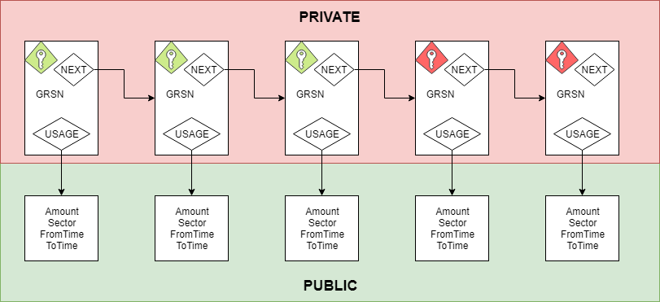
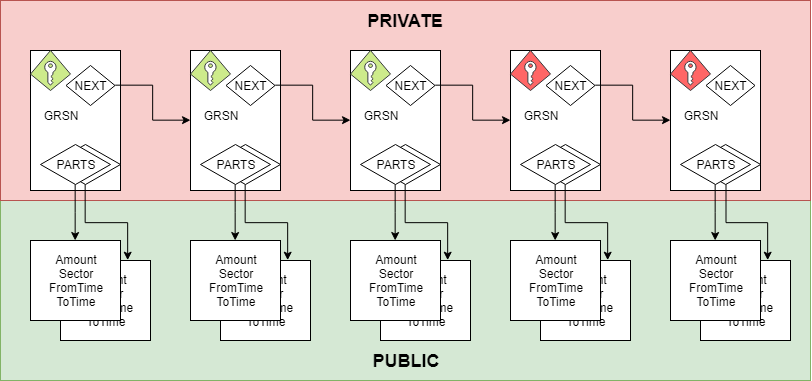
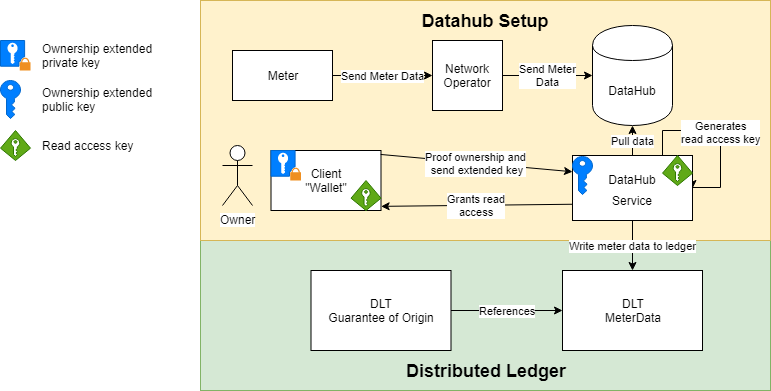
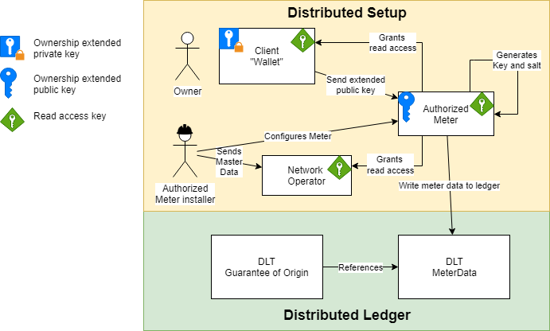
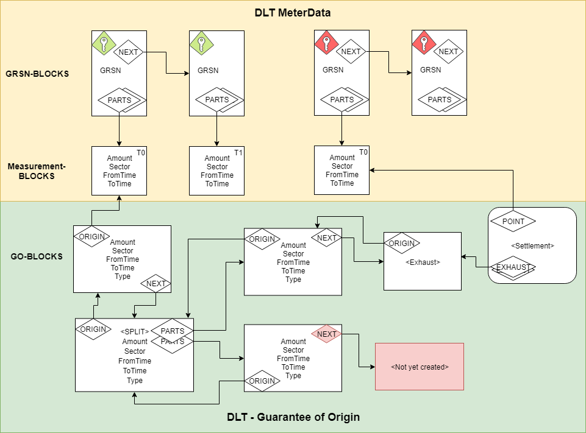

# Project Origin

*THIS IS OUT OF DATE AN NO LONGER THE RELEVANT DOCUMENTATION, [CLICK HERE TO READ THE CURRENT DOCUMENTATION](README.md)*

This project arose from the RED2 directive from the EU. 

The EU commission with RED II communicates that for electro fuels to be classified as green, the issuing bodies must be able to document that the electricity used for the creation of the fuel was renewable.

*"Electricity produced in pumped storage units from water that has previously been pumped uphill should not be considered to be renewable electricity."*

<a href='https://en.energinet.dk/Electricity/Certificates-of-origin'>Energinet</a> is the Guarantee of Origin issuing body in Denmark.

This project is a prototype system for Guarantee of Origin for the electricity grid in Denmark. 

This file contains overall design of the project.

The current version is build on <a href='https://www.hyperledger.org/projects/sawtooth'>Hyperledger Sawtooth</a>, but could be based on other distributed ledger technologies.

# <a id="public-measurement">Public measurements</a>
For everyone to be able to audit the Guarantees of Origin, all the data that the GO are based on, must be made public as well. So for all participating parties, their measurements must be public on the ledger, this will done on a opt-in basis.

This is done in a similar way as <a href='https://blog.iota.org/introducing-masked-authenticated-messaging-e55c1822d50e'>Restricted IOTA MAM streams</a>, where the owner of the meter has access to a private chain of blocks, these contain the GRSN number, a reference to the next block, and references to the measurement-block, which is public. These blocks are still written to the public ledger, and is encrypted, so only the owners of the blocks can read the content. The GRSN-blocks can only be read by knowing the key to the block, and the address of a block in the chain. The owner can revoke access by recycling the key, and creating a new key for future blocks.

 

The measurement-blocks only contains the amount of energy used / produced, the sector (price area), the from and to time, the last part enables higher resolution as we move forward, without changing the underlying platform. Since there is no reference between measurement-blocks without knowing the key to the owning GRSN-blocks, it would be near impossible to isolate a single owners measurements.

There is one assumption here, that no single meter in the sector can be singled out because of size, to solve this issue, any single meters reading can be split in what we named Parts. This way, large powerplants or factories can hide in plain sight without having to disclose their information unless they willingly do so, by giving read access to their GRSN-blocks. 

 

## Ownership

For owners of the each meter to be able to proof their ownership of a measurement-block, each block contains a public-key as the ownership key. Any command signed with the corresponding private key can be validated as the owner performing an operation. To not be able to correlate ownership of measurement-blocks, a new public key is used for every single block. 

Storing all of these private keys, would be very costly for the client, but luckily BitCoin created a solution, <a href='https://github.com/bitcoin/bips/blob/master/bip-0032.mediawiki'>BIP32</a> which enables us to deterministic create public/private keys for each block. It further enables us to give an extended public key to the party creating the blocks, so they can continuously create blocks where only the owner has access over.

The extended key could also be used for address generation for the measurement-blocks, but this is still an undecided question.

## Overview

### Danish setup

In Denmark we currently have a central system called <a href='https://en.energinet.dk/Electricity/DataHub#Documents'>DataHub</a>, which holds data for all electricity meters in Denmark. All DSOs (network operators) in Denmark have a responsibility to send all measurements to the DataHub.

In this project we use this fact, as we already have validated data for onboarded members to upload onto the ledger. Below is a rough overview of the system to onboard and upload data to the ledger.

The DataHub service provides a <a href='https://en.energinet.dk/Electricity/New-player/How-to-become-a-third-party#documents'>third party access</a> to pull data from the DataHub using access granted by the owner of the meter. The user can then upload a extended public key to the DataHub Service, which will write their data to the ledger, at the same time they will be given their read-access key to the ledger.

The "ownership" of the GRSN-blocks is by the DataHub service, and read-access has been granted. It is only the DataHub that can write these blocks to the ledger.

 

### Distributed setup

Since not every country has a similar setup as Denmark with a central DataHub, some thoughts has gone into how this could be done in a more distributed setup.

One thing not on the diagram is trust relationships, that has to be in place. The meter and the install both must be authorized by either the EU or the country responsible, for this kind of setup to work.

The owner of the meter can then give their extended public key to the meter, so it can write data to the ledger, and grant read access back to the owner and related network operator. The network operator is granted read access, since it is anticipated that they must have access to any meter in their grid.

It is important to note, that the actual "ownership" of the GRSN-blocks on the ledger is owned by the meter, and the actual owner. It is the meter itself that writes data to the ledger and grants access and ownership of the measurement-blocks.

 

# Guarantee of Origin (GO)

The project will base all GOs on measurements on the ledger.

A user can then perform a number of operations directly on the ledger:
- Issue GO
- Transfer ownership
- Split GO
- Settle measurement block

 

The address of a root GO-block and settlement blocks is deterministic calculated, so it doesn't have to be referenced directly from the Meter ledger. This way the GO ledger is independent from the meter ledger, and the meter ledger doesn't depend on it.

## Issue GO
To perform this operations, the user must be able to proof ownership of the measurement block on which is should be created. This can only be done by the person holding the Extended Private Key.

The GO would then be created by using the public measurement-block and data stored about the GRSN, so the issuing body can create a GO based on the correct MasterData.

This GO will then contain information about its origin, the amount of energy, from an to when it is applicable, and information about the type of origin. It also contains a pointer to the next address of its life, this is were further operations on the GO block will happen.

Like the measurement blocks, each GO block will contain a public key, signifying the ownership of the block.

## Transfer Ownership

To transfer ownership of a GO, the current owner must request the ledger to transfer ownership to a new public key. This key can be provided by the new owner. 

monetary transactions are currently not supported on this ledger, but integration with a platform like IOTA could facilitate transfer of value and effectuate a transfer of ownership.

After the transfer of ownership, a new block is written to the ledger at the next address, containing the new owners public-key, and a reference to the origin block. 

## Split GO

Since each GO is not of a predefined value like 1kwh og 1mwh, but the size of the originating measurement from the measurement-blocks, one must be able to split a GO into smaller bites, to be able to exhaust it different places, or to facilitate transferring a part of a GO to someone else.

This is done by creating 3 new blocks, one block in the next address, which points to the two new GO blocks. The sum of the amount on the two blocks must equal to origin block, and all other values must be the same as the origin.

A transfer or any other action can afterwards be done independent on the two blocks, which each has their own ownership keys, while preserving the genesis of the blocks.

## Settle measurement block

To settle a measurement block (document where the electricity originates) a settlement block, and several exhaust blocks are created.

Exhaust blocks are created for each GO that is used in the settlement, and has a reference to the settlement block where it is used. The settlement blocks references the exhaust blocks and the measurement-block it settles.

## Further possibilities

Based on this structure, it should be fairly easy to later add more functionality to the GO ledger. This could be how to transfer GO between sectors, append more meta data or other possibilities.

# Cooperation
 
This project is open source, and our wish is for everyone interested to be part of the project and platform.

# Limitations

Hyperledger Sawtooth are known to have some limits on the number of transactions it can process. 

Therefore this can not be taken as a production ready solution, but more as a proof of concept on how to do high resolution GO following the electricity market.

